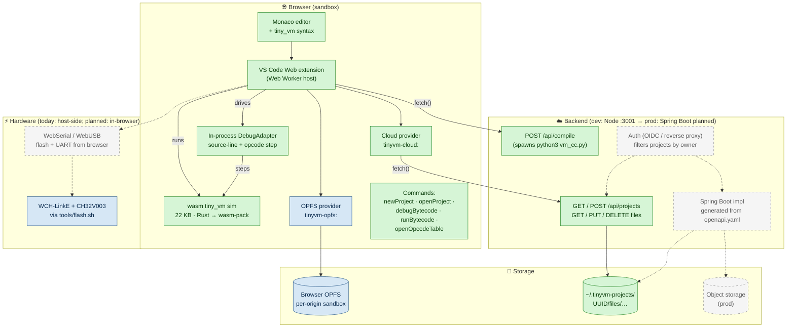
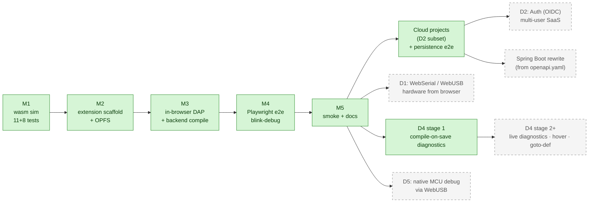
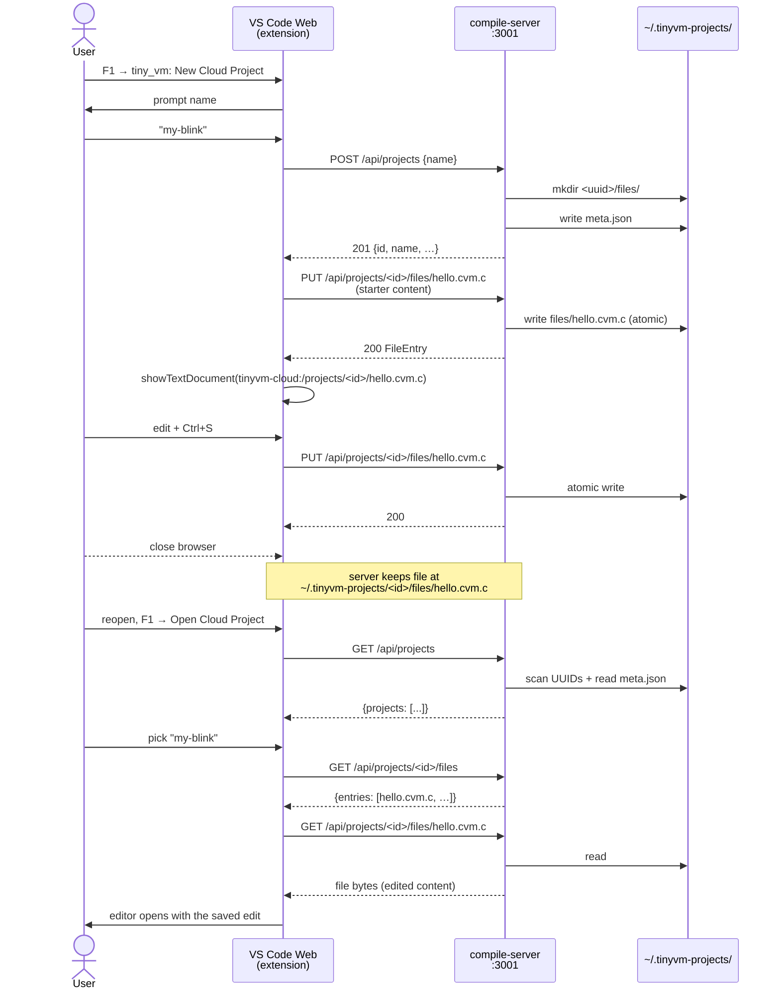
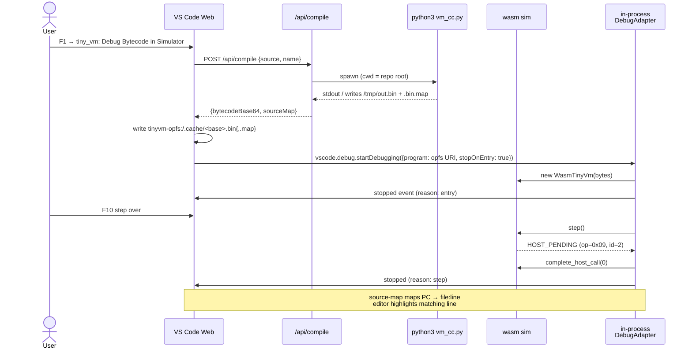
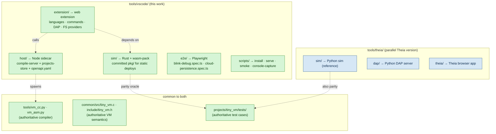

# tiny_vm Web IDE — architecture and roadmap

This is the visual companion to the textual proposals in this directory:

- `docs/vscode_proposal.md` — VS Code Web IDE plan + status (M1..M5).
- `docs/cloud_storage_proposal.md` — server-backed projects + Spring migration plan.
- `docs/theia_proposal.md` — the parallel Theia implementation (`tools/theia/`).

Diagrams below are Mermaid. They render natively in GitHub, in the VS
Code Markdown preview, and at <https://mermaid.live>. To export an SVG
from the command line:

```sh
npx -p @mermaid-js/mermaid-cli mmdc -i docs/architecture.md -o /tmp/architecture.svg
```

---

## System overview

Three layers — browser, backend, storage. **Solid green** means shipped
and exercised by the smoke gate; **solid blue** means shipped but not on
the critical path; **dashed grey** means planned or deferred.



---

## Milestone status (vscode_proposal.md)



---

## Request flow: New Cloud Project → save → close → reopen

The "I should be able to close the browser and reopen and see my project"
loop, end-to-end:



---

## Compile + debug, end-to-end



---

## What's in the repo today



---

## Open decisions

| ID | Question | Current state | Where decided |
|----|----------|---------------|---------------|
| Q1 | Sim language | Rust → wasm-pack | `vscode_proposal.md §8` |
| Q2 | Compile path | Backend API | `vscode_proposal.md §8` + `cloud_storage_proposal.md` |
| – | Storage backend | Filesystem | `cloud_storage_proposal.md §1` |
| – | Project IDs | Server UUIDs | `cloud_storage_proposal.md §1` |
| – | API contract | OpenAPI 3.0 | `tools/vscode/host/openapi.yaml` |
| ❓ | Auth provider | OIDC vs Cloudflare Access vs Tailscale | open |
| ❓ | When to do Spring rewrite | After feature set stabilises | open |
| ❓ | Cloud object storage vs FS in prod | Likely object storage for multi-instance | open |
