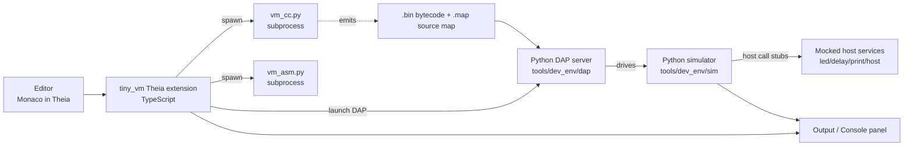

# Development Environment Plan

This is the execution plan for a development environment for the `tiny_vm`
bytecode engine. It expands the original one-paragraph proposal into a spec
that other agents can implement step by step.

**Implementation status (current session):**

| Milestone                              | Status                  |
| -------------------------------------- | ----------------------- |
| M1: source-map emission (`vm_cc.py`/`vm_asm.py --map`) | shipped (4 new tests in `tools/test_vm_tools.py`) |
| M2: host-side simulator                | shipped (`tools/dev_env/sim/`, 16 tests passing) |
| M3: Python DAP server                  | shipped (`tools/dev_env/dap/`, 2 end-to-end tests passing) |
| M4: Theia browser app                  | scaffolded under `tools/dev_env/theia/` (install + build steps in `scripts/install.sh`) |
| M5: hardening + smoke + README         | shipped (`tools/dev_env/scripts/smoke.sh`, `tools/dev_env/README.md`) |

See `tools/dev_env/README.md` for the user-facing entrypoint.

## 1. Purpose and Scope

Goal: provide a unified development environment for authoring, simulating,
and debugging `tiny_vm` programs (`.cvm.c` source and `.vm` assembly), so
that the iterate-test cycle stays on the dev host whenever possible and only
goes to hardware when needed.

In-scope for v1 (this plan):
- Editor for `.cvm.c` and `.vm` files inside Eclipse Theia.
- Host-side bytecode simulator with mocked host calls (`led_write`,
  `delay_ms`, `print_u32`, `print_hex32`, `host(...)`).
- Debug Adapter Protocol (DAP) server that drives the simulator and exposes
  three stepping levels: source line, assembly opcode, raw bytecode.
- Build/run/stop commands and an output panel surfaced as Theia commands.
- Documentation and onboarding inside the IDE.

Deferred to v2 (designed for, not built in v1):
- IDE-driven flashing and on-target UART upload (today's shell scripts stay
  the canonical hardware path).
- Native MCU debugging from the IDE, reusing
  `tools/web_debugger_backend/server.py` as the backend.
- Language Server Protocol (LSP) features beyond what Monaco's built-in
  syntax highlighting gives us (real diagnostics, goto-def, hover).

Explicit non-goals:
- Full MCU emulation (QEMU). The existing on-target regression suite is the
  authoritative hardware check.
- Multi-user concurrent editing. The Pi 5 host is single-user.
- A new bytecode compiler or assembler. `tools/vm_cc.py` and
  `tools/vm_asm.py` remain the single source of truth and are invoked as
  subprocesses.

## 2. Existing Components (Confirmed)

The original proposal asked "C compiler should be already developed - please
confirm". Confirmed. The current tiny_vm toolchain is:

| Component        | Path                                       | Role                                              |
| ---------------- | ------------------------------------------ | ------------------------------------------------- |
| C-like compiler  | `tools/vm_cc.py` (569 lines)               | `.cvm.c` -> `.bin` bytecode (+ optional `.vm`)    |
| Assembler        | `tools/vm_asm.py` (192 lines)              | `.vm` -> `.bin` bytecode                          |
| Uploader         | `tools/vm_upload.py` (71 lines)            | Serial upload of `.bin` to a running VM target    |
| Native runtime C | `common/src/tiny_vm.c`, `common/include/tiny_vm.h` | Stack VM executed on MCU targets          |
| Tool tests       | `tools/test_vm_tools.py`                   | Host regression for compiler/assembler            |
| HW tests         | `tools/test_tiny_vm_hardware.py`           | End-to-end LPC1114 UART regression                |
| Web debugger     | `tools/web_debugger_backend/server.py`     | OpenOCD-driven debugger for native MCU (not VM)   |

Opcode table and language subset are documented in
`projects/tiny_vm/README.md`. The plan below relies on that table verbatim.

## 3. Architecture



Key principles:
- The simulator is a faithful Python port of `common/src/tiny_vm.c`,
  tested against the same bytecode the hardware runs.
- The DAP server is a thin layer that translates DAP requests into
  simulator step/inspect calls. It is a separate process so a crash cannot
  take Theia down.
- The Theia extension is the only TypeScript code. Everything that touches
  bytecode semantics is Python so it can be unit-tested with
  `tools/test_vm_tools.py` style harnesses.

## 4. Repository Layout

All new code lives under `tools/dev_env/`:

```
tools/dev_env/
  README.md                # How to install, run, and develop the IDE
  sim/
    tiny_vm_sim.py         # Python port of common/src/tiny_vm.c
    host_calls.py          # Mocked led_write / delay_ms / print_* / host()
    sourcemap.py           # Reads .map files emitted by vm_cc.py
    cli.py                 # Standalone CLI: run a .bin and print I/O
    test_sim.py            # Unit tests; runs in CI with test_vm_tools.py
  dap/
    server.py              # DAP TCP server (single-client)
    handlers.py            # initialize / launch / setBreakpoints / stackTrace / ...
    test_dap.py            # Talks DAP JSON at server.py for round-trip tests
  theia/
    package.json           # Theia browser application manifest
    tsconfig.json
    src/
      extension/
        tiny-vm-extension.ts          # Activation, commands
        tiny-vm-debug-adapter.ts      # Spawns dap/server.py, wires DAP
        tiny-vm-language-contribution.ts  # File associations, basic grammar
        tiny-vm-commands.ts           # Build, Run-on-Sim, Step, etc.
      grammars/
        cvm-c.tmLanguage.json         # TextMate grammar for .cvm.c
        vm-asm.tmLanguage.json        # TextMate grammar for .vm
    webpack.config.js
  scripts/
    install.sh             # Installs Node, Theia deps, Python venv on Pi 5
    serve.sh               # Starts Theia browser app + DAP server
    smoke.sh               # End-to-end smoke: compile -> sim -> assert output
```

The `theia/` subtree is a complete Theia application (not just an
extension), because the user picked browser-served-from-Pi: we ship the
Theia *application* itself rather than asking the user to install a
separate Theia distribution.

## 5. Component Specifications

### 5.1 Host-side Simulator (`tools/dev_env/sim/`)

Language: Python 3 (matches `vm_cc.py`, `vm_asm.py`,
`web_debugger_backend/server.py`).

Behavioral contract: byte-for-byte equivalent to `common/src/tiny_vm.c` for
every opcode in `projects/tiny_vm/README.md`'s bytecode table. The existing
runtime is the spec; any divergence is a sim bug.

Public Python API:

```python
class TinyVmSim:
    def __init__(self, bytecode: bytes, *, code_max=512, mem_max=128, stack_max=64): ...
    def step(self) -> StepResult: ...        # one opcode
    def run_until_halt(self, *, budget=None) -> RunResult: ...
    @property
    def pc(self) -> int: ...
    @property
    def stack(self) -> list[int]: ...
    @property
    def locals(self) -> list[int]: ...
    @property
    def memory(self) -> bytes: ...
    def attach_host(self, host: HostCalls) -> None: ...
    def add_trace_listener(self, fn: Callable[[Trace], None]) -> None: ...
```

`HostCalls` is the mock-services interface. v1 implementations:

| Host call          | Mock behavior                                                     |
| ------------------ | ----------------------------------------------------------------- |
| `led_write(v)`     | Append `(t, "led", v)` to host log; expose latest state.          |
| `delay_ms(n)`      | Advance virtual time by `n` ms; never wall-sleeps.                |
| `print_u32(v)`     | Emit decimal text to stdout stream of the sim.                    |
| `print_hex32(v)`   | Emit uppercase 8-hex-digit text.                                  |
| `host(id, arg)`    | Look up `id` in a configurable dispatch table; default: log only. |

Exception classes mirror those in the tiny_vm README ("Examples of desired
exception classes"): `StepBudgetExceeded`, `TimeBudgetExceeded`,
`StackOverflow`, `StackUnderflow`, `CodeTooLarge`, `DataMemoryExceeded`,
`InvalidOpcode`, `HostCallFailure`. The DAP layer maps these to DAP
`StoppedEvent` reasons.

CLI form (`python -m tools.dev_env.sim.cli <bin>`):
- runs to halt
- prints captured stdout
- exits with the VM status code

This CLI is what `tools/test_vm_tools.py` should also exercise (extend the
existing tests, do not create a parallel harness).

### 5.2 Source Map (`tools/dev_env/sim/sourcemap.py` + change to `vm_cc.py`)

To support `.cvm.c` source-level stepping, `vm_cc.py` must emit a sidecar
source map alongside the `.bin`. Proposed format `<output>.map`:

```json
{
  "version": 1,
  "source": "projects/tiny_vm/tests/count10.cvm.c",
  "bytecode_size": 27,
  "entries": [
    { "pc": 0,  "line":  5, "col": 3, "kind": "stmt" },
    { "pc": 3,  "line":  6, "col": 3, "kind": "stmt" },
    { "pc": 9,  "line":  7, "col": 5, "kind": "loop_head" }
  ],
  "locals": [
    { "slot": 0, "name": "i",   "line": 3 },
    { "slot": 1, "name": "sum", "line": 4 }
  ]
}
```

Two PRs cleanly separate this work:
1. Add `--map` to `vm_cc.py`. Default off. When on, emit `<out>.map` next
   to the `.bin`. Update `tools/test_vm_tools.py` with a basic schema check.
2. Add `sourcemap.py` in the sim and use it from the DAP server.

`vm_asm.py` gets a similar but smaller change: emit `<out>.map` containing
just `{pc -> source line}` for `.vm` files when `--map` is passed.

### 5.3 DAP Server (`tools/dev_env/dap/`)

Language: Python 3. Transport: TCP on `127.0.0.1` (port chosen at startup,
reported on stdout for the Theia extension to read).

The DAP requests v1 implements:

| Request                | Behavior                                                              |
| ---------------------- | --------------------------------------------------------------------- |
| `initialize`           | Advertises `supportsConfigurationDoneRequest`, breakpoints, stepping. |
| `launch`               | Args: `program` (`.bin` path), `sourceMap` (`.map` path or null), `stopOnEntry`, `hostCallTable`. Loads sim. |
| `configurationDone`    | Begins execution (or stays paused if `stopOnEntry`).                  |
| `setBreakpoints`       | Source breakpoints; resolved through the source map. Unresolved breakpoints reported back as `verified: false`. |
| `setInstructionBreakpoints` | Bytecode-PC breakpoints (assembly view).                         |
| `threads`              | Single synthetic thread `1` named "tiny_vm".                          |
| `stackTrace`           | Synthesizes a frame from current source map entry; falls back to a `pc=0xNNN` frame when no map entry exists. |
| `scopes` / `variables` | Three scopes: Locals (named via source map), Stack (top-down), Memory (paged by 16 bytes). |
| `continue`             | Run to next breakpoint / halt / exception.                            |
| `next` / `stepIn` / `stepOut` | Source-line stepping via source map (`stepIn`/`stepOut` are no-ops in v1 since there are no calls). |
| `stepInstruction`      | Single bytecode opcode. Surfaced in Theia as "Step Instruction".      |
| `disassemble`          | Returns assembly lines around a PC range, using the opcode table.     |
| `evaluate`             | Minimal: only allows reading locals/stack/memory expressions (no side effects). |

Out of scope for v1: `setExceptionBreakpoints` configurability,
`exceptionInfo`, watchpoints, multi-thread, reverse stepping.

Event emissions:
- `output` for sim stdout, LED log, host call log (each a category).
- `stopped` with reasons `entry`, `breakpoint`, `step`, `exception`,
  `pause`.
- `terminated` on `HALT` or unrecoverable error.

Backend abstraction: introduce an interface `class DebugBackend(Protocol)`
with `step()`, `cont()`, `set_breakpoints(...)`, `inspect()`. In v1 the
only implementation is `SimBackend(TinyVmSim)`. In v2 we add
`HardwareBackend(WebDebuggerClient)` that talks to
`tools/web_debugger_backend/server.py`. The DAP layer stays unchanged.

### 5.4 Theia Browser Application (`tools/dev_env/theia/`)

Choice: a Theia *browser* application (not just an extension dropped into
someone else's IDE). It runs on the Pi 5 and is opened from a workstation
browser. This matches the user's choice of "Browser, served from Pi 5".

Versions and dependencies (pin in `package.json`):
- Node.js LTS (whatever Theia's current stable line specifies).
- `@theia/cli`, `@theia/core`, `@theia/editor`, `@theia/monaco`,
  `@theia/debug`, `@theia/terminal`, `@theia/preferences`,
  `@theia/process`, `@theia/output`.
- Build via Theia's standard `theia build` workflow (no custom webpack
  unless required).

Contributions provided by `src/extension/`:
- **Languages**: register `tiny-vm-c` (`.cvm.c`) and `tiny-vm-asm` (`.vm`)
  with TextMate grammars. v1 syntax-highlighting only; LSP is v2.
- **Debug type**: register `tiny-vm` debug type. The extension spawns
  `python3 -m tools.dev_env.dap.server` and connects via TCP.
- **Commands**:
  - `tinyVm.compile` (Cmd/Ctrl+B): runs `vm_cc.py` or `vm_asm.py`
    depending on file type. Output to Theia's `output` panel.
  - `tinyVm.runInSim` (F5 default mapping): compile if stale, then launch
    DAP `launch` with `stopOnEntry: false`.
  - `tinyVm.debugInSim` (Shift+F5): same as run but with `stopOnEntry`.
  - `tinyVm.stepInstruction`: visible in the Debug toolbar when the
    `tiny-vm` adapter is active.
  - `tinyVm.openOpcodeTable`: opens a webview rendering the bytecode table
    from `projects/tiny_vm/README.md` so devs do not need to leave the IDE.
- **Views**:
  - "tiny_vm Stack" tree view (binds to the Stack scope).
  - "tiny_vm Memory" hex view (read-only in v1).
  - "tiny_vm Host Log" output channel.

UI follows the lab-instrument styling rule from `AGENTS.md`
("instrument-like layout", light/dark themes). Reuse Theia's default
theming; do not introduce custom themes in v1.

### 5.5 Build, Install, and Run Glue

`tools/dev_env/scripts/install.sh`:
- checks Node version, installs via nvm if missing
- installs Theia application dependencies (`yarn`)
- creates a Python venv at `tools/dev_env/.venv` with the same Python that
  `tools/vm_cc.py` already runs under
- runs `tests` once to make sure everything links up

`tools/dev_env/scripts/serve.sh`:
- starts `theia start --hostname 0.0.0.0 --port 3000`
- the DAP server is *not* started by serve.sh; the Theia extension spawns
  it on demand per debug session

`tools/dev_env/scripts/smoke.sh`:
- compiles `projects/tiny_vm/tests/count10.cvm.c` with `vm_cc.py --map`
- runs the sim CLI on the result
- asserts stdout is `1\n2\n...\n10\ntiny_vm: halt\n`
- runs the DAP server in a child process and drives a scripted session
  (set source breakpoint at line 4, expect stopped, continue, expect halt)

This smoke script is what new contributors run before merging anything.

## 6. Milestones

Estimates are in "turns" to match `docs/web_debugger_visualization_proposal.md`.
A turn is one user-assistant exchange.

### Milestone 1 - Source Map Emission (3-5 turns)

Scope:
- Add `--map` to `vm_cc.py`; design the `.map` JSON schema.
- Add `--map` to `vm_asm.py`.
- Extend `tools/test_vm_tools.py` with schema and pc->line coverage checks.

Acceptance:
- `vm_cc.py --map` emits a valid `.map` for every existing
  `projects/tiny_vm/tests/*.cvm.c` source.
- `test_vm_tools.py` covers map presence and line monotonicity.

### Milestone 2 - Host-side Simulator (6-9 turns)

Scope:
- Implement `tools/dev_env/sim/tiny_vm_sim.py`, `host_calls.py`,
  `sourcemap.py`, `cli.py`.
- Cross-check every bytecode test in `projects/tiny_vm/tests/` against the
  expected UART output already documented in
  `projects/tiny_vm/README.md`.

Acceptance:
- `tools/dev_env/sim/cli.py <bin>` produces the same output as the
  hardware regression suite for `count10`, `primes1000`, `collatz_max`,
  `checksum8`, `crc32`, `rotate32`, `mem32`, `sha1_abc`.
- Sim unit tests run alongside `test_vm_tools.py`.

### Milestone 3 - DAP Server (6-9 turns)

Scope:
- Implement the DAP server and handlers listed in section 5.3.
- `tools/dev_env/dap/test_dap.py` drives the server over TCP for
  initialize / launch / setBreakpoints / continue / stackTrace flows.

Acceptance:
- A scripted DAP client can set a `.cvm.c` source breakpoint on the
  `count10` test, hit it, inspect the loop counter local, and continue to
  halt.
- `stepInstruction` advances PC by exactly one opcode.

### Milestone 4 - Theia Browser App (10-14 turns)

Scope:
- Bootstrap the Theia browser app under `tools/dev_env/theia/`.
- Implement the contributions in section 5.4 (grammars, debug type,
  commands, views, opcode webview).
- Wire `scripts/install.sh` and `scripts/serve.sh`.

Acceptance:
- `bash tools/dev_env/scripts/install.sh` finishes clean on a stock Pi 5
  Trixie image.
- `bash tools/dev_env/scripts/serve.sh` exposes Theia on `:3000`.
- From the browser, a user can: open `count10.cvm.c`, hit F5, see the
  program run in the sim and produce output in the Theia output panel.
- The same flow with Shift+F5 stops on entry and supports source-line
  stepping plus opcode stepping.

### Milestone 5 - Hardening, Smoke, Docs (4-6 turns)

Scope:
- Implement `scripts/smoke.sh`; wire into CI if/when a CI exists.
- Write `tools/dev_env/README.md` covering install, run, troubleshooting.
- Add a `docs/dev_env/` operator guide if the README grows past a screen.

Acceptance:
- `bash tools/dev_env/scripts/smoke.sh` passes from a clean checkout.
- README links from the top-level `README.md` "Projects" or "Tools"
  section.

### Deferred (v2 milestones, designed-for not built)

- **M6 - IDE-driven hardware flash/upload**: add a `tinyVm.runOnHardware`
  command that runs `tools/flash.sh` and `tools/vm_upload.py` from inside
  Theia, streaming UART back into an output channel.
- **M7 - Native MCU debugging from IDE**: implement the
  `HardwareBackend(WebDebuggerClient)` against
  `tools/web_debugger_backend/server.py`; reuse the v1 DAP server.
- **M8 - LSP for `.cvm.c`**: real diagnostics from `vm_cc.py` parse errors,
  goto-def, hover docs from the opcode table.

Total v1 estimate: 29-43 turns. Comparable in size to the web debugger MVP
(34-52 turns) and slightly smaller because Theia handles most UI infra.

## 7. Risks

- **Theia install footprint on Pi 5**. First-time install pulls a large
  Node/yarn dep tree. Mitigation: install script caches `node_modules`
  outside the repo and offers `--offline` once cached.
- **Sim/runtime divergence**. The sim is a separate codebase from
  `common/src/tiny_vm.c`. Mitigation: every test under
  `projects/tiny_vm/tests/` is a regression case for both.
- **Source map drift**. `vm_cc.py` is hand-written and the map format must
  survive future opcode additions. Mitigation: tests check that every
  emitted instruction has a covering `.map` entry; missing coverage fails
  the build.
- **DAP version skew**. Theia's DAP client and our server must speak the
  same protocol level. Mitigation: pin DAP protocol version constants in
  one shared module; check during `initialize`.
- **Performance on Pi 5 browser**. Theia served from a Pi 5 is usable but
  not snappy. Mitigation: do not block on rendering large memory regions;
  page memory by 16 bytes (already specified).
- **Permission model**. `AGENTS.md` lists what tools are pre-authorized.
  Adding Theia on `:3000` is new and should be added to that list when
  this lands.

## 8. Open Questions

These do not block writing the plan, but should be answered before each
relevant milestone starts.

- M1: Should `.map` files live next to `.bin` outputs (current design) or
  inside the `.bin` as a trailer section? Trailer makes uploads
  self-contained; sidecar is easier to inspect.
- M2: Should the sim model the 15-second boot upload window from the
  runtime, or always start in "execute" mode? Current design: always
  execute, since the sim has no UART to wait on.
- M3: Should DAP `evaluate` allow writing locals/memory? Useful for
  poking, but expands the trust surface. Default: read-only.
- M4: Should the IDE bundle the opcode table as static text, or fetch it
  from `projects/tiny_vm/README.md` at runtime? Fetching avoids drift but
  couples the IDE to the README's markdown structure.
- M5: How should smoke.sh fail when the user has no `.bin` test fixtures
  built yet? Probably auto-build them on first run.

## 9. Reference Files

Reading list for any agent picking up a milestone:

- `projects/tiny_vm/README.md` (opcode table, language subset, regression
  expectations)
- `common/src/tiny_vm.c` and `common/include/tiny_vm.h` (runtime spec)
- `tools/vm_cc.py`, `tools/vm_asm.py`, `tools/vm_upload.py`
- `tools/test_vm_tools.py`, `tools/test_tiny_vm_hardware.py`
- `tools/web_debugger_backend/server.py` (precedent for a Python service
  on the Pi, plus the v2 hardware-debug backend)
- `docs/web_debugger_visualization_proposal.md` (architecture and milestone
  format we are mirroring)
- `AGENTS.md` (UI styling, code standards, granted permissions)
