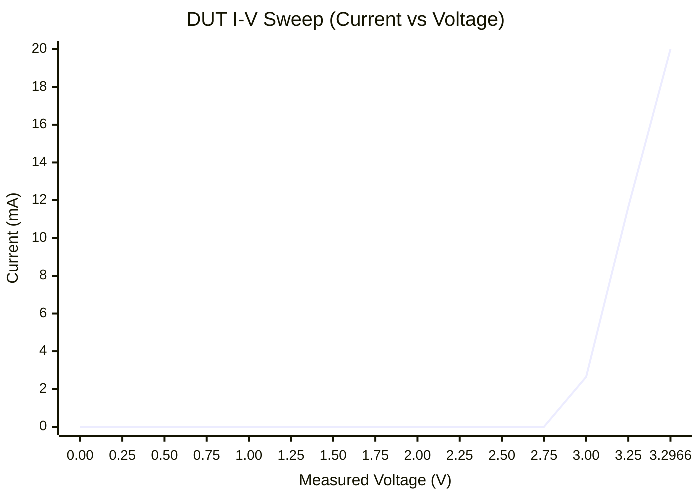

# DPS-150 Sweep Report (2026-03-06)

## Objective
Sweep a 2-terminal DUT with the FNIRSI DPS-150 and capture I-V data while enforcing a strict current limit of **20 mA max**.

## Safety Controls
- Script hard-rejects `--i-limit-ma > 20`.
- Current limit set on PSU before enabling output.
- Output is forced OFF at start and best-effort OFF at end.
- Sweep stops once measured current reaches ~20 mA.

## Script
- `tools/dps150_sweep.py`

Example command used:

```bash
python3 tools/dps150_sweep.py \
  --port /dev/serial/by-id/usb-Artery_AT32_Virtual_Com_Port_13F50CF82565-if00 \
  --v-start 0 --v-stop 5 --v-step 0.25 \
  --i-limit-ma 20 --settle-ms 300 \
  --out-csv results/dps150_sweep.csv
```

## Device Identification (Power Supply)
- Model: `DPS-150`
- Hardware version: `V1.0`
- Firmware version: `V1.2`

## Sweep Results
- Data file: `results/dps150_sweep.csv`
- Points captured: `15`
- Compliance reached at ~`20 mA`.

Key points:

| Set V (V) | Measured V (V) | Measured I (mA) |
|---:|---:|---:|
| 3.00 | 3.00 | 2.644 |
| 3.25 | 3.25 | 11.647 |
| 3.50 | 3.2966 | 20.000 |

Full current curve (measured current in mA):



## DUT Identification Attempt
Based on the I-V shape:
- Near-zero current up to ~2.8-3.0 V.
- Strong nonlinear turn-on around ~3.0-3.3 V.
- Hit current limit at ~3.30 V / 20 mA.

Most likely DUT type: **LED-like or diode-like nonlinear device**, likely with forward conduction knee around ~3 V.

