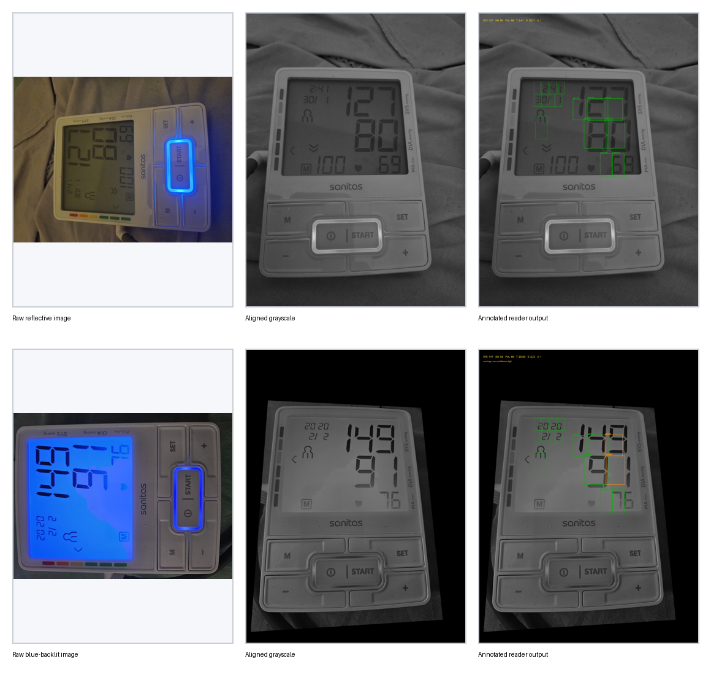
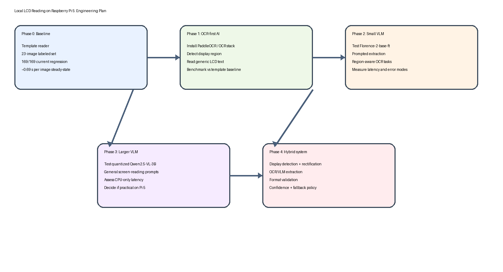

# Local LCD AI Reader Project Plan

## Purpose

This document consolidates the current analysis and defines a practical project
plan for local LCD reading on the Raspberry Pi 5.

The immediate motivation was the Sanitas blood pressure monitor image set in
`experiments/`, but the broader goal is more ambitious:

- move beyond a device-specific template reader
- evaluate local OCR and local vision-language model paths
- determine what is feasible on a `16 GB` Raspberry Pi 5 with CPU-only
  inference
- build a reusable local pipeline for instrument and appliance LCDs

This is an engineering plan, not a marketing statement. The key question is not
whether a model can read *some* LCDs. The key question is whether we can build a
local system with defendable accuracy, bounded latency, and predictable failure
modes.

## Current State

### Local baseline already implemented

The repository now contains a fully local reader for the current blood pressure
monitor dataset:

- `tools/bp_monitor_reader/template_reader.py`
- `tools/bp_monitor_reader/check_ground_truth.py`
- `tools/bp_monitor_reader/README.md`
- `experiments/bp_monitor_ground_truth.csv`

It currently extracts:

- systolic pressure
- diastolic pressure
- pulse
- LCD time
- LCD day/month
- user number
- blue-backlight state

This path is:

- local only
- CPU-only
- no cloud inference
- based on OpenCV alignment plus a calibrated template bank

### Current benchmark status

Current labeled set:

- `23` images in `experiments/`
- ground truth in `experiments/bp_monitor_ground_truth.csv`

Current regression result:

- `169 / 169` populated fields matched the current ground-truth CSV

Current steady-state runtime on this Pi 5:

- about `0.69 s` per image

Important caveat:

- this baseline is calibrated to a single monitor family and a narrow set of
  image/layout conditions
- some labels in the benchmark set were refined while the local reader already
  existed, so the dataset is useful for regression, but it is not yet a clean
  independent test corpus for generalization claims

## Visual Summary

Pipeline examples:

Project roadmap:

## Analysis To Date

### What the current baseline proves

The existing template reader proves three things:

1. Local, offline reading of a real medical-device LCD is already practical on
   this Pi.
2. A perspective-normalization step is valuable.
3. A deterministic local baseline is worth keeping even if we add OCR or VLM
   models later.

That baseline should not be thrown away. It is the benchmark and fallback path.

### What it does not prove

It does **not** prove that we can read arbitrary LCDs.

A general LCD reader must handle variation in:

- layout
- font and segment style
- reflections and glare
- viewing angle
- color/backlight state
- partial occlusion
- iconography and mixed text/graphics

That pushes us toward OCR and/or vision models.

### Feasibility on a 16 GB Pi 5

A useful local system is feasible.

A universal, cloud-level, zero-tuning LCD reader is not the right expectation.

Practical feasibility split:

- segmented instrument LCDs and small monochrome status displays: feasible
- structured appliance screens and embedded UI panels: plausible
- arbitrary consumer UIs under bad capture conditions: harder and slower

### Local environment state

As currently installed on this Pi:

- `cv2`: present
- `torch`: not present
- `transformers`: not present
- `onnxruntime`: not present
- `paddleocr`: not present

So there is no local AI stack installed yet. The next step is not model tuning.
The next step is controlled installation and benchmarking.

## Model Paths To Explore

The instruction is to explore all credible local approaches. The right way to do
that is with a common evaluation harness, not ad hoc tests.

### 1. PaddleOCR

Role:

- OCR-first baseline for more generic LCD reading

Why it matters:

- purpose-built for text extraction
- more deterministic than a general chatty VLM
- likely the strongest practical first step beyond the template reader

Expected strengths:

- numeric/text extraction on normalized display crops
- lower hallucination risk than a general VLM
- easier to reason about failure modes

Expected weaknesses:

- may struggle on faint segmented glyphs without preprocessing
- ARM deployment may be less smooth than x86
- may need a display crop / rectification step ahead of OCR

References:

- PaddleOCR docs: <https://www.paddleocr.ai/main/en/index.html>
- High-performance inference notes: <https://www.paddleocr.ai/latest/en/version3.x/deployment/high_performance_inference.html>

### 2. Florence-2-base-ft

Role:

- first local AI-model path
- small, promptable vision model with explicit OCR capability

Why it matters:

- much lighter than larger VLMs
- supports OCR and OCR-with-region tasks
- likely the best first model if we want a true model-based local reader

Expected strengths:

- promptable extraction
- region-aware tasks
- likely workable on Pi 5 with enough patience

Expected weaknesses:

- more runtime overhead than OCR-first approaches
- likely slower than the current template reader by a large margin
- may still need crop/rectification to be reliable

Reference:

- Florence-2-base-ft model card: <https://huggingface.co/microsoft/Florence-2-base-ft>

### 3. Qwen2.5-VL-3B-Instruct

Role:

- broader multimodal screen-reading experiment
- candidate for more general LCD and small-display interpretation

Why it matters:

- more capable general visual reasoning
- can answer prompted questions about displays
- likely to generalize better across screen types than a narrow OCR tool

Expected strengths:

- broader screen understanding
- can handle icons + text + layout jointly
- may perform better on unfamiliar displays if prompted carefully

Expected weaknesses:

- much heavier on CPU-only Pi 5
- higher latency
- higher hallucination risk
- may require quantization and a runtime such as `llama.cpp`

Reference:

- Qwen2.5-VL-3B-Instruct: <https://huggingface.co/Qwen/Qwen2.5-VL-3B-Instruct>

### 4. Moondream2

Role:

- optional additional small-VLM comparison point

Why it matters:

- explicitly positioned as an efficient VLM
- useful as a compact promptable comparison

Expected strengths:

- smaller runtime footprint than larger VLMs
- good for experimentation

Expected weaknesses:

- less directly targeted at OCR-heavy measurement extraction than PaddleOCR
- likely less authoritative than a stronger OCR pipeline on segmented LCDs

Reference:

- Moondream2 model card: <https://huggingface.co/vikhyatk/moondream2>

## Recommended Architecture

The right system architecture is not “throw a VLM at the raw photo”.

The recommended architecture is:

1. detect the display region
2. rectify perspective
3. normalize contrast / exposure where appropriate
4. run OCR or VLM on the normalized display crop
5. validate against expected field formats
6. emit structured output with confidence and failure reasons

This architecture applies to every path:

- template reader
- PaddleOCR
- Florence-2
- Qwen

That means we should build a **shared harness** first.

## Proposed Work Plan

### Phase 0: Baseline freeze

Deliverables:

- keep the current template reader working
- keep the current benchmark CSV stable
- maintain regression tooling

Success criteria:

- baseline remains runnable and documented
- future model experiments can be compared directly against it

### Phase 1: Common harness

Deliverables:

- a common input/output schema for all backends
- a shared evaluation script
- a shared result directory layout
- a shared benchmark report format

Required outputs per backend:

- structured JSON
- per-field confidence where available
- latency
- optional annotated debug images

Success criteria:

- one command can evaluate a backend against the benchmark CSV
- comparable summary output across all approaches

### Phase 2: OCR-first path

Primary target:

- PaddleOCR

Deliverables:

- local install instructions
- OCR backend wrapper in `tools/bp_monitor_reader/`
- first benchmark against the current dataset

Questions to answer:

- can it read the current monitor without hand-tuned templates?
- can it read time/date and smaller fields robustly?
- how much preprocessing is required?

Go/no-go criteria:

- if OCR is close to the template baseline and generalizes better, keep it as
  the main generic path
- if OCR is weak on segmented digits, continue but do not force it as the only
  architecture

### Phase 3: Small VLM path

Primary target:

- Florence-2-base-ft

Deliverables:

- local inference setup
- prompt design for display reading
- benchmark against the same CSV

Questions to answer:

- can it reliably extract structured numeric fields?
- does it hallucinate unreadable values?
- what is its real latency on Pi 5 CPU-only?

Go/no-go criteria:

- if it is materially slower than OCR but not materially more robust, it should
  not become the main path
- if it generalizes better to varied screens, keep it as a second-stage backend

### Phase 4: Larger VLM path

Primary target:

- Qwen2.5-VL-3B-Instruct, likely quantized

Deliverables:

- working local runtime
- measurement of RAM use and latency
- benchmark on the current set plus deliberately varied display examples

Questions to answer:

- is CPU-only latency acceptable?
- does broader multimodal reasoning help enough to justify the cost?
- can it be made deterministic enough for measurement extraction?

Go/no-go criteria:

- if latency is excessive or outputs are chatty/hallucinatory, keep it as a
  research path only

### Phase 5: Hybrid production candidate

Deliverable:

- final recommendation for a reusable local LCD reader stack

Most likely candidates:

1. `display crop + rectification + PaddleOCR`
2. `display crop + rectification + Florence-2`
3. `hybrid fallback system`: template reader for known devices, OCR/VLM for new
   devices

## Evaluation Criteria

Every backend should be measured on the same axes:

- field accuracy
- blank-vs-invented behavior on unreadable fields
- latency per image
- cold-start latency
- RAM usage
- robustness to backlight and reflective modes
- robustness to rotation and perspective skew
- robustness to small auxiliary fields

Success is not just reading the big numbers. It is avoiding false confidence.

## Risks

### Dataset risk

The current dataset is still small.

Mitigation:

- grow the corpus with more devices and more lighting conditions
- keep a clearly separated hold-out set

### Benchmark contamination risk

Some current labels were refined with help from the existing local reader.

Mitigation:

- create a second independently labeled hold-out set
- avoid training/calibration on that set

### Deployment risk

The Pi currently lacks the required AI runtime stack.

Mitigation:

- install and benchmark one stack at a time
- do not mix dependency experiments without documenting exact versions

### Scope risk

“Any LCD screen” is too broad if left undefined.

Mitigation:

Define screen classes explicitly:

- class A: segmented instrument LCDs
- class B: simple appliance status screens
- class C: richer embedded UI displays

The project should target A first, then B, then evaluate whether C is realistic.

## Immediate Next Steps

1. Freeze the current template-reader benchmark outputs.
2. Add a backend abstraction under `tools/bp_monitor_reader/`.
3. Install the first OCR/model stack locally.
4. Benchmark `PaddleOCR` first.
5. Benchmark `Florence-2-base-ft` second.
6. Attempt `Qwen2.5-VL-3B` only after the smaller path is characterized.

## Current Recommendation

Do not start with Qwen.

The rational sequence is:

1. keep the existing template reader as a benchmark and fallback
2. test `PaddleOCR` as the first generic local LCD reader
3. test `Florence-2-base-ft` as the first small local AI model
4. test `Qwen2.5-VL-3B` only as a broader screen-generalization experiment

That sequence minimizes wasted effort and gives clean comparisons.
