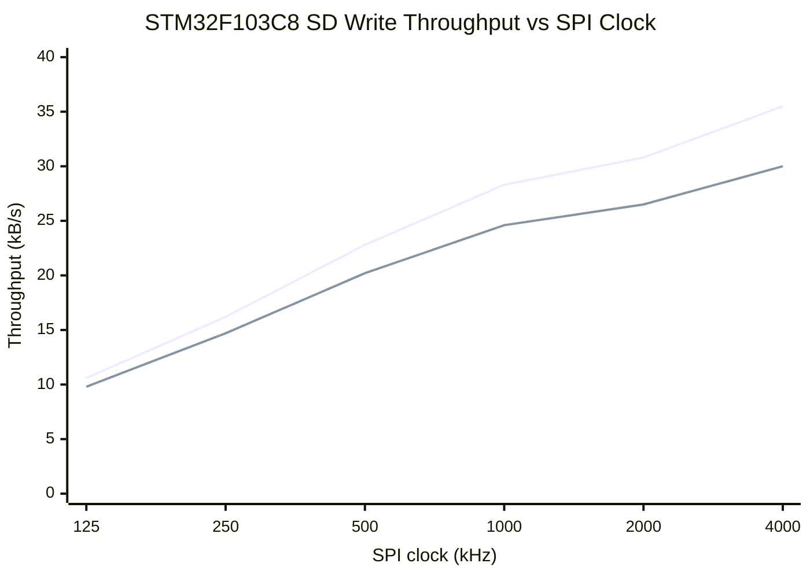
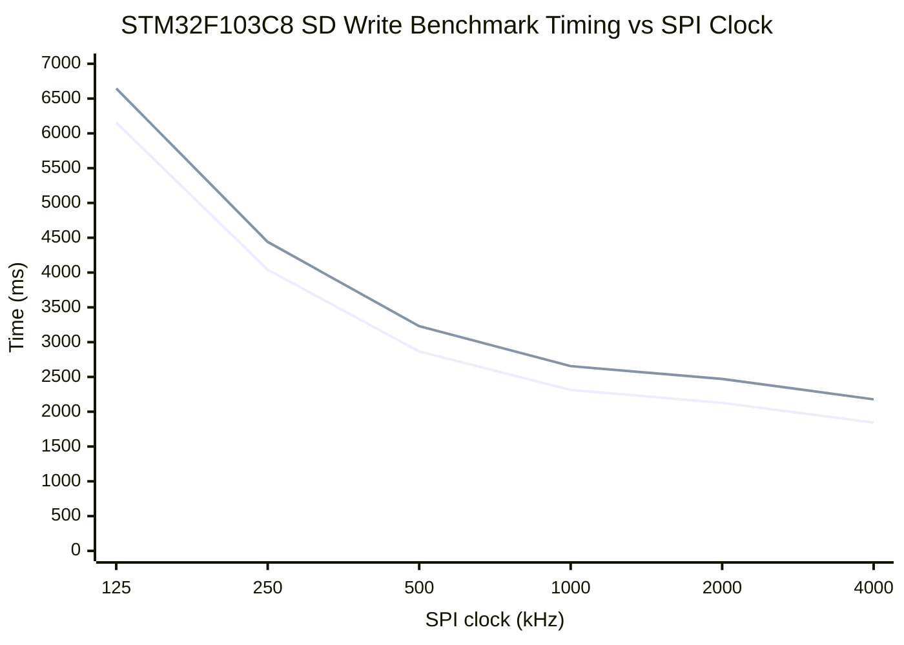
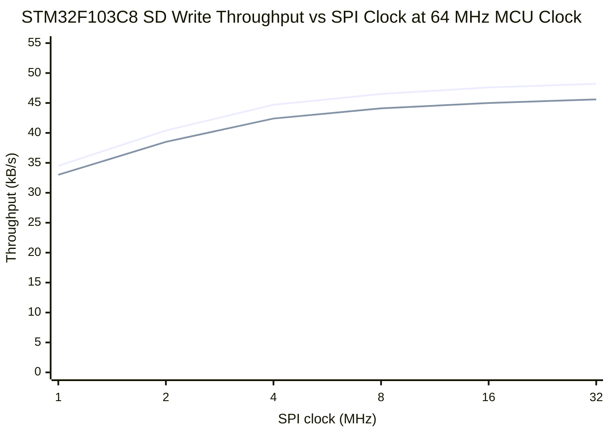
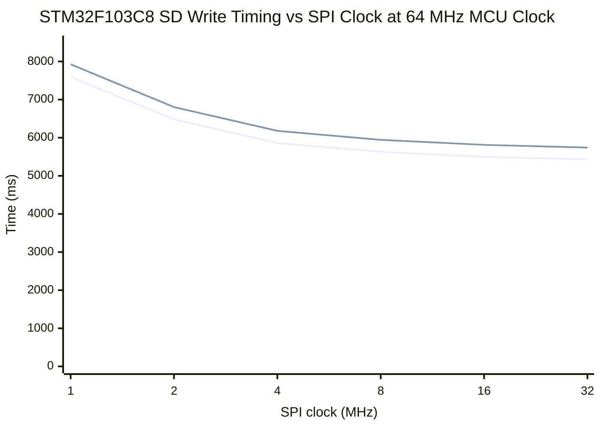
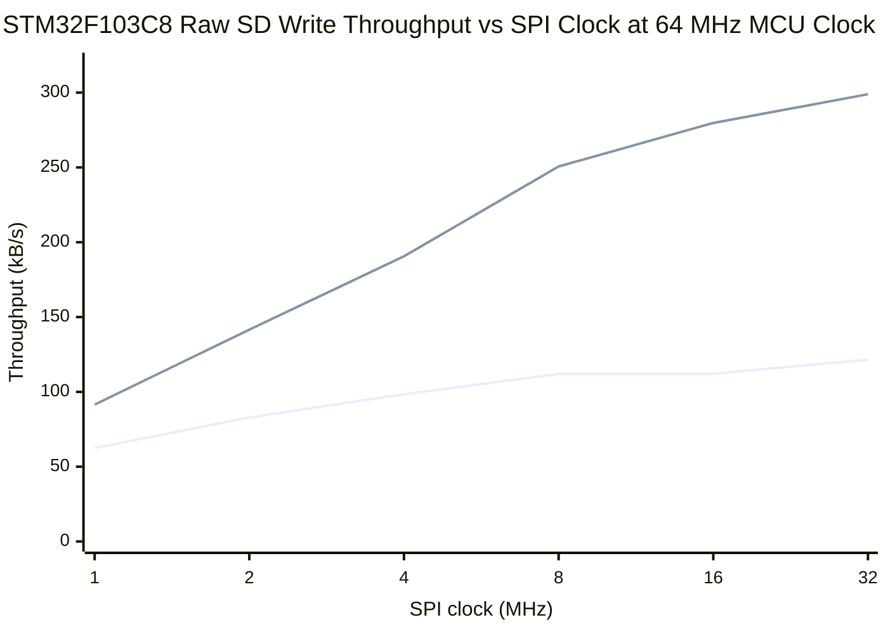

# STM32 SD Write Benchmark Report (2026-03-12)

## Objective
Measure how STM32F103C8 SD-card write throughput varies with SPI clock, and determine the fastest realistic sustained logging rate on this card.

## Hardware
- MCU: `STM32F103C8`
- SD interface: `SPI1`
- Wiring:
  - `PA4` -> SD pin `1` (`CS`)
  - `PA5` -> SD pin `5` (`CLK`)
  - `PA6` -> SD pin `7` (`MISO`)
  - `PA7` -> SD pin `2` (`MOSI`)
- UART: `USART1` on `PA9`/`PA10` at `57600`
- Debug/programming: Raspberry Pi Pico 2 running `debugprobe`
- Card under test: working Raspberry Pi OS SD card

## Software
- Benchmark project: `projects/sd_write_bench/stm32f103c8_c`
- Sweep runner: `tools/benchmark_sd_spi_speeds.py`
- Filesystem: `FatFs R0.16`
- MCU clock: default `8 MHz` internal `HSI`
- SPI clock: `8 MHz / prescaler`

## Method
- Mount the first FAT32 partition.
- Create or overwrite `CODXBEN.BIN`.
- Write `64 KiB` in `4096` byte chunks.
- Measure:
  - write-loop time only
  - sync/close time
  - total time
- Repeat across SPI prescalers:
  - `/2`, `/4`, `/8`, `/16`, `/32`, `/64`

This is a file-level benchmark, not a raw-sector maximum-throughput test. It includes FAT and card-management overhead. The card is modified by creating or overwriting `CODXBEN.BIN`.

## Results
Data file:
- `results/stm32_sd_write_benchmark_spi_sweep_2026-03-12.csv`

| Divider | SPI clock | Write ms | Sync/close ms | Total ms | Write rate kB/s | Total rate kB/s |
|---:|---:|---:|---:|---:|---:|---:|
| /64 | 125 kHz | 6155 | 490 | 6645 | 10.6 | 9.8 |
| /32 | 250 kHz | 4041 | 399 | 4440 | 16.2 | 14.7 |
| /16 | 500 kHz | 2865 | 364 | 3229 | 22.8 | 20.2 |
| /8 | 1.0 MHz | 2314 | 341 | 2655 | 28.3 | 24.6 |
| /4 | 2.0 MHz | 2127 | 344 | 2471 | 30.8 | 26.5 |
| /2 | 4.0 MHz | 1843 | 335 | 2178 | 35.5 | 30.0 |

Best result in this sweep:
- Prescaler `/2`
- SPI clock `4.0 MHz`
- Write-loop throughput `35.5 kB/s`
- End-to-end throughput `30.0 kB/s`

## Throughput Chart

Series order:
- first line: write-loop throughput
- second line: end-to-end throughput

## Latency Chart

Series order:
- first line: write-loop time
- second line: end-to-end time

## Observations
- Throughput rises monotonically with SPI clock in this sweep.
- The improvement is not linear with clock. From `1 MHz` to `4 MHz`, write-loop throughput improves from `28.3` to `35.5 kB/s`, not by `4x`.
- `sync/close` overhead stays in the `335-490 ms` range and becomes a larger fraction of total time at higher SPI clocks.
- This indicates the benchmark is not limited by bus rate alone. Card internal latency, FAT bookkeeping, and file allocation overhead are already material.

## Practical Conclusion
- With the current `8 MHz` MCU clock and file-level `FatFs` path, `4 MHz` SPI is the best setting tested.
- If the goal is higher logging throughput, the next measurements should be:
  - larger benchmark files to reduce fixed `f_sync` distortion
  - raw-sector writes for comparison against the file-level path
  - higher MCU clock so the SPI bus can be pushed beyond `4 MHz`

## Follow-Up: 64 MHz MCU Clock, 256 KiB Transfer

To push beyond the first sweep, the benchmark was extended to:

- switch the MCU to `64 MHz` using `HSI/2 * 16`
- keep `APB1` within limits by dividing it by `2`
- write a longer `256 KiB` file to reduce fixed `f_sync` distortion

Data file:
- `results/stm32_sd_write_benchmark_spi_sweep_64mhz_256k_2026-03-12.csv`

| Divider | SPI clock | Write ms | Sync/close ms | Total ms | Write rate kB/s | Total rate kB/s |
|---:|---:|---:|---:|---:|---:|---:|
| /64 | 1.0 MHz | 7592 | 333 | 7925 | 34.5 | 33.0 |
| /32 | 2.0 MHz | 6483 | 321 | 6804 | 40.4 | 38.5 |
| /16 | 4.0 MHz | 5859 | 321 | 6180 | 44.7 | 42.4 |
| /8 | 8.0 MHz | 5630 | 313 | 5943 | 46.5 | 44.1 |
| /4 | 16.0 MHz | 5496 | 317 | 5813 | 47.6 | 45.0 |
| /2 | 32.0 MHz | 5432 | 309 | 5741 | 48.2 | 45.6 |

Best result in this sweep:
- Prescaler `/2`
- SPI clock `32 MHz`
- Write-loop throughput `48.2 kB/s`
- End-to-end throughput `45.6 kB/s`

### Throughput Chart

Series order:
- first line: write-loop throughput
- second line: end-to-end throughput

### Timing Chart

Series order:
- first line: write-loop time
- second line: end-to-end time

### What This Means
- Raising the MCU clock from `8 MHz` to `64 MHz` helped materially.
- Increasing SPI beyond about `8-16 MHz` helped only a little:
  - `8 MHz` SPI: `46.5 kB/s`
  - `16 MHz` SPI: `47.6 kB/s`
  - `32 MHz` SPI: `48.2 kB/s`
- That flattening is the key result. The current setup is no longer bus-limited in a strong way.

## Follow-Up: Raw Contiguous-Region Benchmark

To separate filesystem overhead from card write performance, a second benchmark path was added:

- project: `projects/sd_raw_write_bench/stm32f103c8_c`
- sweep runner: `tools/benchmark_sd_raw_write_speeds.py`
- MCU clock: `64 MHz`
- transfer length per run: `256 KiB`
- reserved raw region: host-prepared contiguous file `CODXLOG.BIN`
- raw region mapping:
  - `start_lba = 13053`
  - `sector_count = 16384`
  - file size = `8 MiB`

This path bypasses `FatFs` during the hot write loop and writes directly into the reserved sector range. Two modes were tested:

- `single`: `CMD24` single-block writes
- `multi`: `CMD25` multi-block writes

For each run, the firmware read back the first and last written sectors and verified the on-card pattern.

Data file:
- `results/stm32_sd_raw_write_benchmark_spi_sweep_64mhz_256k_2026-03-12.csv`

| Divider | SPI clock | Single total rate kB/s | Multi total rate kB/s | Multi speedup |
|---:|---:|---:|---:|---:|
| /64 | 1.0 MHz | 62.5 | 91.5 | 1.46x |
| /32 | 2.0 MHz | 82.9 | 141.6 | 1.71x |
| /16 | 4.0 MHz | 98.4 | 190.6 | 1.94x |
| /8 | 8.0 MHz | 112.0 | 250.6 | 2.24x |
| /4 | 16.0 MHz | 112.1 | 279.7 | 2.49x |
| /2 | 32.0 MHz | 121.5 | 298.9 | 2.46x |

Best measured raw result in this sweep:
- Prescaler `/2`
- SPI clock `32.0 MHz`
- Single-block throughput `121.5 kB/s`
- Multi-block throughput `298.9 kB/s`

### Raw Throughput Chart

Series order:
- first line: raw single-block total throughput
- second line: raw multi-block total throughput

### File-Level vs Raw Comparison

| Path | Best setting | Throughput |
|---|---|---:|
| `FatFs` file-level, end-to-end | `64 MHz` MCU, `32 MHz` SPI | `45.6 kB/s` |
| Raw single-block | `64 MHz` MCU, `32 MHz` SPI | `121.5 kB/s` |
| Raw multi-block | `64 MHz` MCU, `32 MHz` SPI | `298.9 kB/s` |

Key comparison:
- raw single-block is about `2.7x` faster than the best file-level `FatFs` path
- raw multi-block is about `6.6x` faster than the best file-level `FatFs` path

## Sustained Runs at the Best Setting

The peak raw result above used a `256 KiB` transfer. To check whether that rate holds over longer captures, the best setting was rerun at:

- `64 MHz` MCU clock
- `32 MHz` SPI clock
- divider `/2`

Data file:
- `results/stm32_sd_raw_write_benchmark_long_runs_64mhz_2026-03-12.csv`

| Transfer size | Single total rate kB/s | Multi total rate kB/s |
|---:|---:|---:|
| `1 MiB` | `115.0` | `280.9` |
| `4 MiB` | `117.4` | `273.1` |
| `8 MiB` | `117.4` | `277.0` |

Interpretation:
- single-block throughput stays essentially flat at about `115-117 kB/s`
- multi-block throughput drops slightly from the `256 KiB` peak of `298.9 kB/s` to about `273-281 kB/s` on longer runs
- the `8 MiB` run completed cleanly across the full reserved region, so `32 MHz` SPI is at least stable over that write length on this card and wiring

## Current Best Measured Capture Rate

Measured on this exact card and setup:
- best short-run result: about `299 kB/s` using raw multi-block writes into a preallocated contiguous region
- best longer sustained result: about `273-281 kB/s` over `1-8 MiB`

That is the best current answer to the “fastest realistic capture rate” question.

The defensible practical number for planning is:
- `~275 kB/s` sustained

The peak number that has been demonstrated in a shorter benchmark is:
- `~300 kB/s`

## What This Means

- The file-level `FatFs` path is dominated by filesystem and card-management overhead once SPI reaches roughly `8-16 MHz`.
- Simply increasing SPI clock does not materially improve the file-level path after that point.
- The real step change comes from changing the write strategy:
  - preallocated contiguous region
  - no filesystem work in the hot loop
  - `CMD25` multi-block writes
- On this setup, that changes the practical ceiling from about `46 kB/s` to about `275-300 kB/s`.

## Next Useful Experiments

1. Increase the reserved contiguous region beyond `8 MiB` and rerun the raw multi-block benchmark to check for longer-term rate drift.
2. Add `ACMD23` pre-erase before `CMD25` and measure whether this particular card benefits.
3. Compare the reserved-file raw path against a dedicated raw partition with identical write patterns.
4. Test whether a smaller MCU can still sustain an acceptable fraction of this rate with the same contiguous-region approach.
