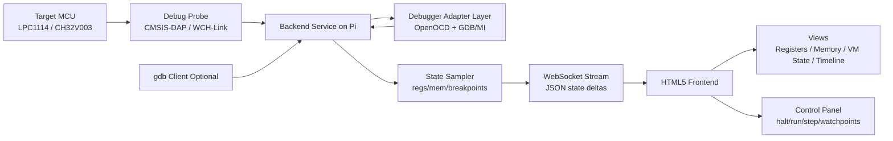

# Web Debugger Visualization Proposal

## Goal

Build a web application running on the Raspberry Pi that receives target state data from the debugger probe toolchain and visualizes processor state (registers, selected memory regions, execution state) in near real time.

Target devices in scope:
- LPC1114 (ARM Cortex-M0 via OpenOCD + GDB)
- CH32V003 (RISC-V, initially best-effort support depending on backend capabilities)

## Why This Is Feasible

This approach is established in pieces:
- backend debugger control via OpenOCD/GDB MI
- browser UIs over WebSocket streams
- embedded telemetry dashboards

The proposal combines these into one system optimized for your workflow.

## Proposed Architecture

## Control Model (Single Owner)

Use a single-owner debug model:
- backend service is the only component that owns target control
- backend talks to OpenOCD/GDB adapter and probe
- web UI and optional CLI/gdb clients use backend APIs/endpoints only

Why:
- avoids multi-controller conflicts (run/halt/step races, breakpoint/watchpoint desync)
- keeps one authoritative session state for UI + automation

## Backend Debug Interfaces

Recommended protocol stack:
- backend <-> OpenOCD:
  - OpenOCD TCL command socket (read/write commands)
  - optional OpenOCD process control/stdio

- backend <-> gdb client (optional):
  - backend exposes a GDB-server-compatible endpoint/proxy
  - gdb connects to backend endpoint (not directly to probe)

- backend <-> web frontend:
  - WebSocket (JSON snapshots/events; binary optional later)

## Data Model (Initial)

Message types:
- `session_status`: connected/running/halted/error
- `register_snapshot`: register key/value map + timestamp
- `memory_snapshot`: address + bytes + format metadata
- `event`: breakpoint hit, watchpoint hit, reset, fault
- `metrics`: sample interval, dropped frames, backend latency

Transport:
- WebSocket, JSON messages (easy to iterate)
- later optional binary frame mode for higher sampling rates

## UI Scope (Phase 1)

- Register panel:
  - core registers (ARM: r0-r15,xPSR; RISC-V: x0-x31,pc where available)
  - value display in hex + signed/unsigned decimal

- Memory panel:
  - watched regions by address
  - word/byte views with changed-byte highlighting

- UART panel:
  - RX-only text stream from the debugprobe mirror UART
  - pause/clear display controls

- Execution panel:
  - run/halt/step/reset controls
  - current PC, halt reason, last breakpoint/watchpoint

- Timeline panel:
  - sampled state ticks
  - event markers

## Backend Scope (Phase 1)

- Spawn and manage debugger sessions
- Poll selected registers and memory on interval
- Push snapshots + events to WebSocket clients
- Basic command API:
  - `connect`, `disconnect`
  - `run`, `halt`, `step`, `reset`
  - `set_watch(address,size,type)`
  - `read_mem(address,len)`, `read_regs()`

## Performance Targets

- Initial sampling target: 5-20 Hz stable updates
- UI render budget: <50 ms for normal snapshot sizes
- Graceful degradation under load:
  - sampling decimation
  - partial/delta updates

## Risks and Constraints

- Debug transport limits real-time visibility (especially while running fast code)
- intrusive polling can perturb timing-sensitive tests
- CH32V003 toolchain/debug feature parity may be weaker than LPC1114 path
- concurrent terminal/debug use can cause serial contention if not managed carefully

## Mitigations

- explicit sampling modes:
  - `halted-only` (high fidelity)
  - `run-poll` (best effort)

- configurable watch sets to keep payload small
- ring-buffered backend event queue with drop metrics
- strict single-owner policy per debug session (frontend control lock)

## Implementation Plan

1. Backend MVP
- Node.js or Python service on Pi [prefer python]
- OpenOCD/GDB MI adapter for LPC1114
- WebSocket endpoint + basic JSON schema

2. Frontend MVP
- single-page app
- register + memory table views
- run/halt/step controls

3. Eventing and Watchpoints
- breakpoint/watchpoint UI
- event timeline

4. CH32V003 Integration
- evaluate OpenOCD/GDB capabilities for equivalent data paths
- implement feature matrix per target

5. Hardening
- reconnection handling
- session logs
- export snapshots to CSV/JSON

## Success Criteria

- Can connect to LPC1114 session and visualize registers/memory updates in browser
- Can halt/run/step from browser controls
- Can inspect VM-relevant state (`pc`, stack pointer, selected RAM addresses)
- Can capture and review event timeline for one debug run

## Milestones and Turn Estimate

Terminology:
- `turn` = one user-assistant exchange in this chat.

Estimated effort for a usable MVP:
- ~34 to 52 turns total, depending on protocol/debug surprises.

### Milestone 1 - Design Lock and Contracts (4-6 turns)

Scope:
- freeze single-owner control model
- define backend API and WebSocket JSON schemas
- define first target scope (LPC1114 first, CH32V003 deferred)
- use Python for the initial backend implementation

Acceptance checks:
- interface contract documented in this repo
- message schema examples for `session_status`, `register_snapshot`, `memory_snapshot`, `event`
- clear non-goals listed for MVP

Deliverables:
- `docs/web_debugger_api_contract.md`
- this proposal document as the architecture overview

### Milestone 2 - Backend Session Core (8-12 turns)

Scope:
- backend process manager for OpenOCD + GDB/MI session
- deterministic session state machine (`disconnected`, `connected`, `running`, `halted`, `error`)
- command endpoints: `connect`, `disconnect`, `run`, `halt`, `step`, `reset`

Acceptance checks:
- backend can connect/disconnect target repeatedly without manual cleanup
- backend can run/halt/step/reset LPC1114 from API calls
- session transitions logged and externally visible

### Milestone 3 - State Sampling and Normalization (8-12 turns)

Scope:
- periodic register and watched-memory polling
- normalized architecture-neutral payloads (with arch-specific fields where needed)
- event queue for breakpoint/watchpoint/reset/fault notifications

Acceptance checks:
- stable 5-20 Hz register snapshots while halted
- memory watch regions update with changed-byte markers
- dropped-sample metric reported when overloaded

### Milestone 4 - Frontend MVP (8-12 turns)

Scope:
- HTML5 single-page UI
- live views: registers, watched memory, execution status
- controls: connect/run/halt/step/reset

Acceptance checks:
- browser reflects backend state transitions in near real time
- register/memory views update without full-page refresh
- controls are serialized via backend lock (no conflicting actions)

### Milestone 5 - Integration, Reliability, Documentation (6-10 turns)

Scope:
- end-to-end validation on real hardware sessions
- timeout/reconnect/error handling
- operator docs and troubleshooting guide

Acceptance checks:
- scripted smoke test passes on LPC1114 session start -> step -> run -> halt -> disconnect
- common failure modes documented (probe busy, OpenOCD down, stale session)
- README links to runbook and architecture doc
