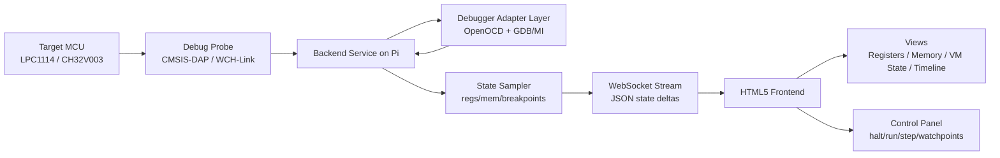

# Web Debugger Visualization Proposal

## Goal

Build a web application running on the Raspberry Pi that receives target state data from the debugger probe toolchain and visualizes processor state (registers, selected memory regions, execution state) in near real time.

Target devices in scope:
- LPC1114 (ARM Cortex-M0 via OpenOCD + GDB)
- CH32V003 (RISC-V, initially best-effort support depending on backend capabilities)

## Why This Is Feasible

This approach is established in pieces:
- backend debugger control via OpenOCD/GDB MI
- browser UIs over WebSocket streams
- embedded telemetry dashboards

The proposal combines these into one system optimized for your workflow.

## Proposed Architecture

## Data Model (Initial)

Message types:
- `session_status`: connected/running/halted/error
- `register_snapshot`: register key/value map + timestamp
- `memory_snapshot`: address + bytes + format metadata
- `event`: breakpoint hit, watchpoint hit, reset, fault
- `metrics`: sample interval, dropped frames, backend latency

Transport:
- WebSocket, JSON messages (easy to iterate)
- later optional binary frame mode for higher sampling rates

## UI Scope (Phase 1)

- Register panel:
- core registers (ARM: r0-r15,xPSR; RISC-V: x0-x31,pc where available)
- value display in hex + signed/unsigned decimal

- Memory panel:
- watched regions by address
- word/byte views with changed-byte highlighting

- Execution panel:
- run/halt/step/reset controls
- current PC, halt reason, last breakpoint/watchpoint

- Timeline panel:
- sampled state ticks
- event markers

## Backend Scope (Phase 1)

- Spawn and manage debugger sessions
- Poll selected registers and memory on interval
- Push snapshots + events to WebSocket clients
- Basic command API:
- `connect`, `disconnect`
- `run`, `halt`, `step`, `reset`
- `set_watch(address,size,type)`
- `read_mem(address,len)`, `read_regs()`

## Performance Targets

- Initial sampling target: 5-20 Hz stable updates
- UI render budget: <50 ms for normal snapshot sizes
- Graceful degradation under load:
- sampling decimation
- partial/delta updates

## Risks and Constraints

- Debug transport limits real-time visibility (especially while running fast code)
- intrusive polling can perturb timing-sensitive tests
- CH32V003 toolchain/debug feature parity may be weaker than LPC1114 path
- concurrent terminal/debug use can cause serial contention if not managed carefully

## Mitigations

- explicit sampling modes:
- `halted-only` (high fidelity)
- `run-poll` (best effort)

- configurable watch sets to keep payload small
- ring-buffered backend event queue with drop metrics
- strict single-owner policy per debug session (frontend control lock)

## Implementation Plan

1. Backend MVP
- Node.js or Python service on Pi
- OpenOCD/GDB MI adapter for LPC1114
- WebSocket endpoint + basic JSON schema

2. Frontend MVP
- single-page app
- register + memory table views
- run/halt/step controls

3. Eventing and Watchpoints
- breakpoint/watchpoint UI
- event timeline

4. CH32V003 Integration
- evaluate OpenOCD/GDB capabilities for equivalent data paths
- implement feature matrix per target

5. Hardening
- reconnection handling
- session logs
- export snapshots to CSV/JSON

## Success Criteria

- Can connect to LPC1114 session and visualize registers/memory updates in browser
- Can halt/run/step from browser controls
- Can inspect VM-relevant state (`pc`, stack pointer, selected RAM addresses)
- Can capture and review event timeline for one debug run
