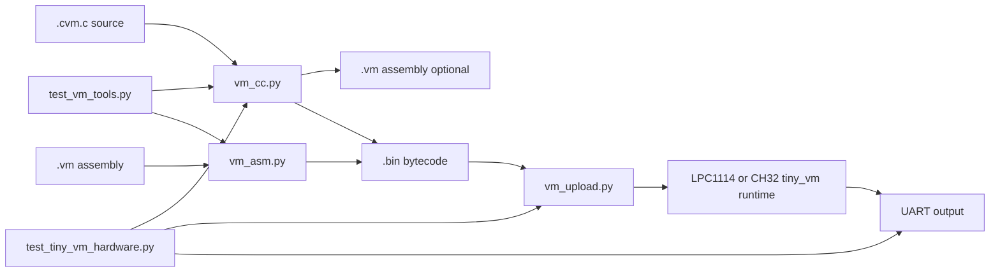

# tiny_vm

Small stack-based bytecode VM running on both:
- `projects/tiny_vm/lpc1114_c`
- `projects/tiny_vm/ch32v003_c`

Program layout:
- regression-style finite test programs: `projects/tiny_vm/tests/`
- long-running or manual demos: `projects/tiny_vm/demos/`

## Runtime protocol

Targets now execute uploaded bytecode (no built-in hardcoded program).

Upload frame format:
- magic: `TVM1` (4 bytes)
- length: little-endian `uint16`
- payload: bytecode
- checksum: `sum(payload) & 0xff`

Both runtimes wait 15 seconds after boot for an upload, then continue waiting for frames.

## Host tools

- assembler: `tools/vm_asm.py`
- minimal C-like compiler: `tools/vm_cc.py`
- uploader: `tools/vm_upload.py`
- host regression tests: `tools/test_vm_tools.py`
- hardware UART regression tests: `tools/test_tiny_vm_hardware.py`

## Toolchain Flow



## Tool Details

### `tools/vm_cc.py`

Purpose:
- compile the tiny C-like subset into tiny_vm bytecode

Inputs:
- `.cvm.c` source file

Outputs:
- `.bin` bytecode (required)
- `.vm` assembly listing (optional, with `-S`)

Typical usage:
```sh
./tools/vm_cc.py projects/tiny_vm/tests/count10.cvm.c -o /tmp/count10.bin
./tools/vm_cc.py projects/tiny_vm/tests/collatz_max.cvm.c -S /tmp/collatz.vm -o /tmp/collatz.bin
```

What it does internally:
- strips comments
- tokenizes the tiny C-like language
- parses declarations, control flow, and expressions
- lowers the program into stack-machine assembly
- optionally writes the assembly listing
- invokes `tools/vm_asm.py` to produce final bytecode

Use it when:
- you want the most convenient authoring format
- you are writing or editing tiny_vm programs by hand

### `tools/vm_asm.py`

Purpose:
- assemble human-readable tiny_vm assembly into raw bytecode

Inputs:
- `.vm` assembly file

Outputs:
- `.bin` bytecode

Typical usage:
```sh
./tools/vm_asm.py /tmp/program.vm -o /tmp/program.bin
```

Use it when:
- you want precise control over emitted instructions
- you are debugging compiler output
- you want to hand-author or minimize bytecode

### `tools/vm_upload.py`

Purpose:
- send a compiled tiny_vm image to a target runtime over UART

Protocol:
- wraps the bytecode in the runtime upload frame:
  - `TVM1`
  - payload length (`uint16`, little-endian)
  - payload
  - checksum (`sum(payload) & 0xff`)

Typical usage:
```sh
./tools/vm_upload.py /tmp/count10.bin --port /dev/ttyACM1 --baud 57600
```

Use it when:
- the target runtime is already flashed
- you want fast iterate/test cycles without reflashing MCU flash every time

### `tools/test_vm_tools.py`

Purpose:
- host-side regression tests for the compiler and assembler

What it verifies:
- assembler encoding for representative instructions
- compiler emission of expected instructions/markers
- support for key language features used by current demos

Typical usage:
```sh
./tools/test_vm_tools.py
```

Use it when:
- changing the compiler
- changing the assembler
- adding new opcodes or syntax

### `tools/test_tiny_vm_hardware.py`

Purpose:
- end-to-end hardware regression against the LPC1114 runtime

What it verifies:
- runtime can be flashed
- bytecode can be uploaded
- selected programs execute to completion
- observed UART output matches expected output exactly

Typical usage:
```sh
python3 tools/test_tiny_vm_hardware.py
python3 tools/test_tiny_vm_hardware.py --only collatz_max
python3 tools/test_tiny_vm_hardware.py --no-flash --only count10
```

Use it when:
- changing the VM runtime
- changing the upload framing
- changing compiler semantics and you want a real-device check

## Recommended Workflow

For normal development:
1. edit a program in `projects/tiny_vm/tests/` or `projects/tiny_vm/demos/`
2. run `./tools/test_vm_tools.py` if you changed compiler/assembler behavior
3. compile with `tools/vm_cc.py`
4. flash the runtime only when needed
5. upload with `tools/vm_upload.py`
6. check UART output

For VM/runtime changes:
1. run `./tools/test_vm_tools.py`
2. run `python3 tools/test_tiny_vm_hardware.py`
3. only then proceed to larger feature work

## Quick start

Compile sample source:
```sh
./tools/vm_cc.py projects/tiny_vm/tests/count10.cvm.c -o /tmp/count10.bin
```

Compile prime-number demo (up to 1000):
```sh
./tools/vm_cc.py projects/tiny_vm/tests/primes1000.cvm.c -o /tmp/primes1000.bin
```

Flash tiny_vm runtime (LPC1114):
```sh
./tools/flash.sh --target lpc1114 --lang c --project tiny_vm
```

Upload bytecode to LPC1114 primary UART:
```sh
./tools/vm_upload.py /tmp/count10.bin --port /dev/ttyACM1 --baud 57600
```

Prime demo upload:
```sh
./tools/vm_upload.py /tmp/primes1000.bin --port /dev/ttyACM1 --baud 57600
```

Compile Collatz max-step demo (range 1..100):
```sh
./tools/vm_cc.py projects/tiny_vm/tests/collatz_max.cvm.c -o /tmp/collatz_max.bin
./tools/vm_upload.py /tmp/collatz_max.bin --port /dev/ttyACM1 --baud 57600
```

Expected output:
```text
97
118
```

## Hardware Regression

Run all finite-output LPC1114 demo regressions:
```sh
python3 tools/test_tiny_vm_hardware.py
```

Run one case only:
```sh
python3 tools/test_tiny_vm_hardware.py --only collatz_max
```

Notes:
- the script auto-detects debugprobe primary/mirror UART ports
- it reflashes the LPC1114 `tiny_vm` runtime by default
- it verifies exact UART output for:
  - `count10`
  - `primes1000`
  - `collatz_max`
- `demos/blink.cvm.c` is intentionally excluded because it does not emit UART output and does not halt

## Demos

Current long-running/manual demo:
- `projects/tiny_vm/demos/blink.cvm.c`
- this is useful for manual runtime checks, but it is not part of the automated UART regression suite

## C-like language subset (v1)

- declarations:
- `const int NAME = <const_expr>;`
- `int var;`
- `int var = <expr>;`
- statements:
- assignment: `var = <expr>;`
- `while (<expr>) { ... }`
- `if (<expr>) { ... } else { ... }`
- calls:
- `led_write(expr);`
- `delay_ms(expr);`
- `print_u32(expr);`
- `host(const_expr, expr);`
- expressions:
- literals, vars, consts
- `+`, `-`, `*`, `/`, `%`, `<`, `>`, `==`

Assembler/VM opcodes now include:
- `PUSH8`, `PUSH16`
- arithmetic/comparison: `ADD`, `SUB`, `MUL`, `DIV`, `MOD`, `EQ`, `LT`
- locals: `LGET`, `LSET`
