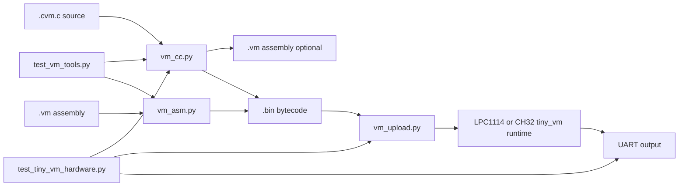

# tiny_vm

Small stack-based bytecode VM running on both:
- `projects/tiny_vm/lpc1114_c`
- `projects/tiny_vm/ch32v003_c`

## Project Goal

The long-term goal of `tiny_vm` is to support sending small programs over radio to remote sensor devices so that deployed nodes can change behavior without a full native firmware update.

Examples of intended use:
- take sensor readings at configurable intervals
- react to simple stimuli or host-provided events
- perform local filtering or decision logic
- report compact results back through host firmware

Design constraint:
- keep the VM runtime comfortably below `16 kB` of native code/data footprint

This means flexibility is important, but bounded resource use and architectural discipline are more important than feature count.

## Design Intent

`tiny_vm` is intended to grow incrementally, but not by accreting ad hoc opcodes.

The VM should evolve according to a documented roadmap so that:
- new opcodes fit a coherent model
- resource limits remain enforceable
- the host/VM boundary stays narrow and auditable
- future capabilities (timers, events, buffers, radio-facing host services) can be added without major refactoring

For now, versioned incompatibility is acceptable. Bytecode format and opcode set may evolve as long as versioning is explicit and changes are intentional.

## Execution Model

All of the following execution styles are in scope:
- run-once programs that halt
- long-running programs (for example polling loops)
- host-invoked programs launched on demand by the master firmware

Important requirement:
- the host firmware must be able to place hard upper bounds on resources consumed by a VM program

Examples of bounded resources:
- VM instruction count / CPU work
- elapsed execution time
- stack usage
- local/data memory usage

If a budget is exceeded, the VM should stop and report a structured exception to the caller.

Examples of desired exception classes:
- runtime/step budget exceeded
- elapsed-time budget exceeded
- stack overflow
- stack underflow
- code too large
- data memory exceeded
- invalid opcode
- host call failure

## Host / VM Boundary

The host/VM interface should remain intentionally small.

Current model:
- VM programs interact with the outside world only through host calls
- native firmware owns hardware drivers, scheduling, radio, and safety policy

Proposed direction:
- keep the VM as a policy/logic engine
- keep native firmware as the authority for hardware access and communications

That implies:
- no direct hardware register access from bytecode
- no direct radio stack control from bytecode
- all external effects occur via a constrained host API

Recommended host API shape for future growth:
- scalar sensor reads
- simple actuator writes
- timer/sleep requests
- event fetch / event acknowledge
- small message submit / receive hooks
- access to bounded scratch or retained storage provided by the host

This keeps the trust boundary narrow and makes resource accounting easier.

## State Model

Current assumption:
- no required persistence across sleep, reset, or power loss

Possible future extension:
- a small host-managed non-volatile storage bank may be exposed so programs can resume coarse state after reset if needed

This should remain optional and host-mediated, not transparent VM memory persistence.

## Numeric Model

Current target:
- 32-bit integer-oriented VM
- signed and unsigned integer use cases are both in scope at the language/runtime level

Design note:
- even if floating point is not implemented soon, the bytecode architecture should not make future numeric expansion impossible

## Memory Model Roadmap

The intended progression is:
- scalar locals (already present)
- small arrays / scratch buffers
- byte-addressable memory access

Why:
- sensor processing and packet-oriented logic quickly require indexed data access
- array/buffer support is more scalable than endlessly increasing local slot count

## Safety and Resource Control

Safety is a primary design goal.

The VM must be suitable for running code received from outside the node's native firmware image, so:
- execution must be bounded
- memory use must be bounded
- host interaction must be bounded
- failures must be detectable and reportable

Preferred operating model:
- the caller supplies a resource budget
- the VM runs until:
  - the program halts
  - a budget is exceeded
  - a runtime error occurs
- the VM returns a status code plus failure reason

## Planned Capability Roadmap

This is the working roadmap for future sessions. New features should be evaluated against this order unless there is a strong reason to deviate.

### Phase 1: Stabilize The Current Core

Goals:
- maintain a small, testable stack VM
- keep the compiler, assembler, uploader, and runtime aligned
- preserve strong regression coverage for finite-output programs

Includes:
- arithmetic/control flow core
- UART-observable regression programs
- hardware regression workflow

### Phase 2: Add Structured Data Access

Goals:
- enable arrays and scratch buffers
- reduce pressure to add many special-purpose locals or host calls

Likely additions:
- indexed load/store
- bounded scratch memory region
- explicit data-size limits and errors

Why this comes early:
- many useful sensor and message-processing tasks depend on buffer access

Current status:
- Phase 2 has started in minimal form
- the VM now has a bounded byte scratch memory region plus byte load/store primitives
- this is enough for simple buffer-oriented tests, but not yet enough for full packet-processing workloads

### Phase 3: Add Bitwise And Shift Operations

Goals:
- support efficient low-level integer logic
- enable checksums, encodings, and future crypto primitives

Likely additions:
- `AND`, `OR`, `XOR`, `NOT`
- `SHL`, `SHR`
- possibly `ROL`, `ROR`

Why:
- required for efficient protocols, framing, and serious hash functions

Current status:
- Phase 3 has started
- the VM now has a minimal bitwise core:
  - `AND`, `OR`, `XOR`, `NOT`
  - `SHL`, `SHR`, `ROL`, `ROR`
  - `PUSH32` for full-width integer literals
- this is enough to support bounded checksum and CRC-style algorithms without yet committing to a full crypto-oriented design

### Phase 4: Add Time And Event Primitives

Goals:
- support sensor polling and stimulus-driven logic without bloating the VM core

Likely direction:
- host-managed timer API
- event fetch/dispatch model
- host-invoked execution with explicit budgets

Architectural preference:
- keep scheduling policy in native firmware
- expose only minimal time/event hooks to bytecode

### Phase 5: Expand The Host Service Interface

Goals:
- support real sensor/actuator logic while preserving a narrow trust boundary

Likely additions:
- scalar sensor reads
- bounded writes / control outputs
- small message or packet service hooks
- optional retained-state access

Constraint:
- host calls should remain coarse and capability-oriented, not a raw syscall soup

### Phase 6: Add More Advanced Compute Primitives

Goals:
- support richer algorithms while respecting size limits

Possible features:
- stronger integer utilities
- limited cryptographic helpers
- eventually optional numeric-model expansion (for example fixed-point first, float later if justified)

Guardrail:
- prefer reusable primitives over one-off opcodes tailored to a single demo

## Out Of Scope For Now

Not yet committed and should be treated as out of scope unless explicitly added later:
- dynamic allocation
- recursion
- threads or preemptive multitasking
- direct hardware register access
- direct radio stack control
- transparent persistence across reset/power loss
- strict long-term bytecode backward compatibility

These may be revisited later, but they should not be assumed.

Program layout:
- regression-style finite test programs: `projects/tiny_vm/tests/`
- long-running or manual demos: `projects/tiny_vm/demos/`

## SHA-1 Feasibility And Next Step

The VM is now close to the minimum arithmetic feature set needed for a real hash:
- 32-bit literals (`PUSH32`)
- bitwise boolean ops
- shifts
- rotates
- bounded scratch memory

That means the main remaining constraints are no longer arithmetic. They are:
- bytecode size
- scratch-memory layout
- efficient 32-bit word access inside the message schedule

### What SHA-1 Needs

For a practical SHA-1 implementation in this VM, the runtime/compiler need to support:
- loading a 512-bit message block (`64` bytes)
- building and updating the SHA-1 message schedule
- five 32-bit working registers (`a`, `b`, `c`, `d`, `e`)
- 80 rounds of bounded integer work

A compact SHA-1 implementation does not need to store all 80 schedule words.
It can use a rolling 16-word schedule buffer:
- `w[i] = rol1(w[i-3] xor w[i-8] xor w[i-14] xor w[i-16])`
- only the most recent 16 words need to be retained

This is the right target for `tiny_vm` because it avoids over-designing the runtime around one large algorithm.

### Why The Current Limits Are Tight

Current limits:
- `TINY_VM_CODE_MAX = 512`
- `TINY_VM_MEM_MAX = 128`

These are the current preparatory limits for SHA-1 work.

Reasoning:
- `64` bytes of scratch memory is enough for one message block only
- a rolling 16-word schedule buffer also needs `64` bytes if stored as 32-bit words
- so a clean single-block SHA-1 design wants about `128` bytes of scratch just for:
  - input block bytes
  - 16-word rolling schedule
- `512` bytes of bytecode is a more realistic starting point once the compiler emits:
  - message setup
  - schedule expansion
  - 80-round compression loop
  - final output

### Recommended Preparatory Change

This preparatory change is now in place:
- `TINY_VM_CODE_MAX` increased from `256` to `512`
- `TINY_VM_MEM_MAX` increased from `64` to `128`

Why this is a good trade:
- it directly addresses the real constraint
- it does not add architectural complexity
- it keeps the runtime small
- it avoids adding one-off opcodes just to squeeze around arbitrary limits

Impact:
- mostly RAM footprint, not flash footprint
- code buffer grows by `256` bytes
- scratch memory grows by `64` bytes
- total VM state increase is about `320` bytes

This is acceptable relative to the current LPC1114 runtime size, which is still well below the `<16 kB` flash target.

### Still Missing For A Clean SHA-1 Implementation

Even after increasing the limits, one capability is still missing for a clean implementation:
- efficient 32-bit word access in scratch memory

Current scratch memory now supports both byte and little-endian 32-bit word access:
- `store8(index, value)`
- `load8(index)`
- `store32le(index, value)`
- `load32le(index)`

This is enough for early SHA-1 implementation work because the schedule is naturally word-oriented.

Semantics:
- `index` addresses the first byte of a 32-bit little-endian word in scratch memory
- out-of-range access remains a bounded VM runtime error

This keeps the design coherent:
- byte access for byte-oriented protocols
- word access for word-oriented algorithms

### Recommended SHA-1 Path

The current recommended order is:
1. use the new `CODE_MAX=512`, `MEM_MAX=128` limits
2. use bounded `load32le()` / `store32le()` primitives
3. add a single-block SHA-1 regression test with a fixed known vector
4. only after that, decide whether multi-block SHA-1 is worth the extra complexity

Recommended first SHA-1 regression style:
- fixed message
- deterministic UART output
- halts cleanly

Example candidate:
- input: `"abc"`
- expected SHA-1:
  - `A9993E364706816ABA3E25717850C26C9CD0D89D`

Current status:
- the first single-block SHA-1 regression is now implemented as:
  - `projects/tiny_vm/tests/sha1_abc.cvm.c`
- it uses a fixed `"abc"` block and prints the five 32-bit digest words as uppercase hex
- this proves the current VM core can execute a real cryptographic hash for at least a fixed, bounded regression case

This keeps the next step aligned with the project goal:
- real capability growth
- bounded complexity
- strong regression coverage

## Runtime protocol

Targets now execute uploaded bytecode (no built-in hardcoded program).

Upload frame format:
- magic: `TVM1` (4 bytes)
- length: little-endian `uint16`
- payload: bytecode
- checksum: `sum(payload) & 0xff`

Both runtimes wait 15 seconds after boot for an upload, then continue waiting for frames.

## Host tools

- assembler: `tools/vm_asm.py`
- minimal C-like compiler: `tools/vm_cc.py`
- uploader: `tools/vm_upload.py`
- host regression tests: `tools/test_vm_tools.py`
- hardware UART regression tests: `tools/test_tiny_vm_hardware.py`

## Toolchain Flow



## Tool Details

### `tools/vm_cc.py`

Purpose:
- compile the tiny C-like subset into tiny_vm bytecode

Inputs:
- `.cvm.c` source file

Outputs:
- `.bin` bytecode (required)
- `.vm` assembly listing (optional, with `-S`)

Typical usage:
```sh
./tools/vm_cc.py projects/tiny_vm/tests/count10.cvm.c -o /tmp/count10.bin
./tools/vm_cc.py projects/tiny_vm/tests/collatz_max.cvm.c -S /tmp/collatz.vm -o /tmp/collatz.bin
```

What it does internally:
- strips comments
- tokenizes the tiny C-like language
- parses declarations, control flow, and expressions
- lowers the program into stack-machine assembly
- optionally writes the assembly listing
- invokes `tools/vm_asm.py` to produce final bytecode

Use it when:
- you want the most convenient authoring format
- you are writing or editing tiny_vm programs by hand

### `tools/vm_asm.py`

Purpose:
- assemble human-readable tiny_vm assembly into raw bytecode

Inputs:
- `.vm` assembly file

Outputs:
- `.bin` bytecode

Typical usage:
```sh
./tools/vm_asm.py /tmp/program.vm -o /tmp/program.bin
```

Use it when:
- you want precise control over emitted instructions
- you are debugging compiler output
- you want to hand-author or minimize bytecode

### `tools/vm_upload.py`

Purpose:
- send a compiled tiny_vm image to a target runtime over UART

Protocol:
- wraps the bytecode in the runtime upload frame:
  - `TVM1`
  - payload length (`uint16`, little-endian)
  - payload
  - checksum (`sum(payload) & 0xff`)

Typical usage:
```sh
./tools/vm_upload.py /tmp/count10.bin --port /dev/ttyACM1 --baud 57600
```

Use it when:
- the target runtime is already flashed
- you want fast iterate/test cycles without reflashing MCU flash every time

### `tools/test_vm_tools.py`

Purpose:
- host-side regression tests for the compiler and assembler

What it verifies:
- assembler encoding for representative instructions
- compiler emission of expected instructions/markers
- support for key language features used by current demos

Typical usage:
```sh
./tools/test_vm_tools.py
```

Use it when:
- changing the compiler
- changing the assembler
- adding new opcodes or syntax

### `tools/test_tiny_vm_hardware.py`

Purpose:
- end-to-end hardware regression against the LPC1114 runtime

What it verifies:
- runtime can be flashed
- bytecode can be uploaded
- selected programs execute to completion
- observed UART output matches expected output exactly

Typical usage:
```sh
python3 tools/test_tiny_vm_hardware.py
python3 tools/test_tiny_vm_hardware.py --only collatz_max
python3 tools/test_tiny_vm_hardware.py --no-flash --only count10
```

Use it when:
- changing the VM runtime
- changing the upload framing
- changing compiler semantics and you want a real-device check

## Recommended Workflow

For normal development:
1. edit a program in `projects/tiny_vm/tests/` or `projects/tiny_vm/demos/`
2. run `./tools/test_vm_tools.py` if you changed compiler/assembler behavior
3. compile with `tools/vm_cc.py`
4. flash the runtime only when needed
5. upload with `tools/vm_upload.py`
6. check UART output

For VM/runtime changes:
1. run `./tools/test_vm_tools.py`
2. run `python3 tools/test_tiny_vm_hardware.py`
3. only then proceed to larger feature work

## Quick start

Compile sample source:
```sh
./tools/vm_cc.py projects/tiny_vm/tests/count10.cvm.c -o /tmp/count10.bin
```

Compile prime-number demo (up to 1000):
```sh
./tools/vm_cc.py projects/tiny_vm/tests/primes1000.cvm.c -o /tmp/primes1000.bin
```

Flash tiny_vm runtime (LPC1114):
```sh
./tools/flash.sh --target lpc1114 --lang c --project tiny_vm
```

Upload bytecode to LPC1114 primary UART:
```sh
./tools/vm_upload.py /tmp/count10.bin --port /dev/ttyACM1 --baud 57600
```

Prime demo upload:
```sh
./tools/vm_upload.py /tmp/primes1000.bin --port /dev/ttyACM1 --baud 57600
```

Compile Collatz max-step demo (range 1..100):
```sh
./tools/vm_cc.py projects/tiny_vm/tests/collatz_max.cvm.c -o /tmp/collatz_max.bin
./tools/vm_upload.py /tmp/collatz_max.bin --port /dev/ttyACM1 --baud 57600
```

Expected output:
```text
97
118
```

Compile simple checksum/buffer demo:
```sh
./tools/vm_cc.py projects/tiny_vm/tests/checksum8.cvm.c -o /tmp/checksum8.bin
./tools/vm_upload.py /tmp/checksum8.bin --port /dev/ttyACM1 --baud 57600
```

Expected output:
```text
15
```

Compile CRC-32 demo (`"123456789"` test vector):
```sh
./tools/vm_cc.py projects/tiny_vm/tests/crc32.cvm.c -o /tmp/crc32.bin
./tools/vm_upload.py /tmp/crc32.bin --port /dev/ttyACM1 --baud 57600
```

Expected output:
```text
CBF43926
```

Compile rotate demo:
```sh
./tools/vm_cc.py projects/tiny_vm/tests/rotate32.cvm.c -o /tmp/rotate32.bin
./tools/vm_upload.py /tmp/rotate32.bin --port /dev/ttyACM1 --baud 57600
```

Expected output:
```text
34567812
78123456
```

Compile 32-bit scratch-memory demo:
```sh
./tools/vm_cc.py projects/tiny_vm/tests/mem32.cvm.c -o /tmp/mem32.bin
./tools/vm_upload.py /tmp/mem32.bin --port /dev/ttyACM1 --baud 57600
```

Expected output:
```text
12345678
A5A5A5A5
```

Compile SHA-1 `"abc"` regression:
```sh
./tools/vm_cc.py projects/tiny_vm/tests/sha1_abc.cvm.c -o /tmp/sha1_abc.bin
./tools/vm_upload.py /tmp/sha1_abc.bin --port /dev/ttyACM1 --baud 57600
```

Expected output:
```text
A9993E36
4706816A
BA3E2571
7850C26C
9CD0D89D
```

## Hardware Regression

Run all finite-output LPC1114 demo regressions:
```sh
python3 tools/test_tiny_vm_hardware.py
```

Run one case only:
```sh
python3 tools/test_tiny_vm_hardware.py --only collatz_max
```

Notes:
- the script auto-detects debugprobe primary/mirror UART ports
- it reflashes the LPC1114 `tiny_vm` runtime by default
- it verifies exact UART output for:
  - `count10`
  - `primes1000`
  - `collatz_max`
  - `checksum8`
  - `crc32`
  - `rotate32`
  - `mem32`
  - `sha1_abc`
- `demos/blink.cvm.c` is intentionally excluded because it does not emit UART output and does not halt

## Demos

Current long-running/manual demo:
- `projects/tiny_vm/demos/blink.cvm.c`
- this is useful for manual runtime checks, but it is not part of the automated UART regression suite

## C-like language subset (v1)

- declarations:
- `const int NAME = <const_expr>;`
- `int var;`
- `int var = <expr>;`
- statements:
- assignment: `var = <expr>;`
- `while (<expr>) { ... }`
- `if (<expr>) { ... } else { ... }`
- calls:
- `led_write(expr);`
- `delay_ms(expr);`
- `print_u32(expr);`
- `print_hex32(expr);`
- `host(const_expr, expr);`
- `store8(index_expr, value_expr);`
- `store32le(index_expr, value_expr);`
- expressions:
- literals, vars, consts
- `load8(index_expr)`
- `load32le(index_expr)`
- `and32(a, b)`, `or32(a, b)`, `xor32(a, b)`, `not32(a)`
- `shl32(a, b)`, `shr32(a, b)`
- `rol32(a, b)`, `ror32(a, b)`
- `+`, `-`, `*`, `/`, `%`, `<`, `>`, `==`

Assembler/VM opcodes now include:
- `PUSH8`, `PUSH16`, `PUSH32`
- arithmetic/comparison: `ADD`, `SUB`, `MUL`, `DIV`, `MOD`, `EQ`, `LT`
- bitwise/shift: `AND`, `OR`, `XOR`, `NOT`, `SHL`, `SHR`, `ROL`, `ROR`
- locals: `LGET`, `LSET`
- scratch memory: `MGET`, `MSET`, `MGET32`, `MSET32`

Scratch memory notes:
- the runtime provides a bounded byte-addressable scratch region
- current size: `128` bytes (`TINY_VM_MEM_MAX`)
- `store8()` truncates written values to 8 bits
- `load8()` returns the selected byte as a non-negative integer
- `store32le()` stores a 32-bit value in little-endian order
- `load32le()` reconstructs a 32-bit little-endian value
- out-of-range access is a VM runtime error
